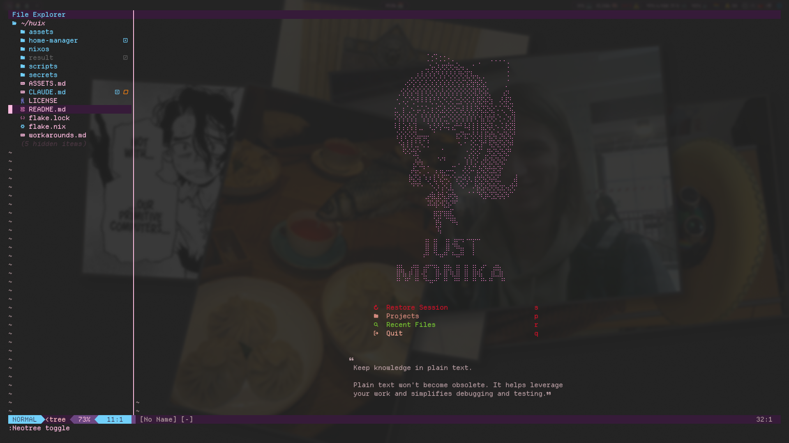

<div align="center">

# ddlc.nvim

**The Doki Doki Literature Club colorscheme for neovim, light and dark** （´ω｀♡%）


[](https://github.com/rokokol/ddlc-palette)
[](LICENSE)
[](https://github.com/rokokol/ddlc.nvim/actions/workflows/build.yml)

[Русский](README.ru.md)

</div>

Every colour is measured off [ddlc.moe](https://ddlc.moe) by [ddlc-palette](https://github.com/rokokol/ddlc-palette) and arrives here as a base16 scheme — the theme picks which slot goes where and nothing else. Core groups, treesitter captures, LSP semantic tokens and diagnostics, plus a telescope integration

Came over from my rice, **[rokokol/huix](https://github.com/rokokol/huix)**

## Contents

- [What it looks like](#what-it-looks-like)
- [Install](#install)
  - [lazy.nvim](#lazynvim)
  - [nixvim](#nixvim)
  - [No plugin manager](#no-plugin-manager)
- [Options](#options)
- [Transparency](#transparency)
- [What it covers](#what-it-covers)
- [Tests](#tests)
- [Layout](#layout)
- [License](#license)

## What it looks like


> The file tree, the start screen and the tab bar carry no integration of their own — they take the core groups, which is what an integration should be needed for as rarely as possible

## Install

### lazy.nvim

```lua
{
  "rokokol/ddlc.nvim",
  lazy = false,
  priority = 1000,
  opts = {},          -- see below; the defaults are a dark, opaque theme
}
```

`opts` is `require("ddlc").setup`, so any other manager works the same way — the plugin needs nothing but the call, and `:colorscheme ddlc` after it

### nixvim

```nix
{
  inputs.ddlc-nvim.url = "github:rokokol/ddlc.nvim";

  # in your nixvim configuration
  programs.nixvim = {
    imports = [ inputs.ddlc-nvim.nixvimModules.ddlc ];

    ddlc.nixvim = {
      enable = true;
      settings.transparent = true;   # the same table setup takes, unchanged
    };
  };
}
```

That installs the plugin, calls `setup` before the colours are laid down and names `ddlc` as the colorscheme. `package` overrides the plugin itself

### No plugin manager

```sh
git clone https://github.com/rokokol/ddlc.nvim ~/.local/share/nvim/site/pack/themes/start/ddlc.nvim
```

Then `:colorscheme ddlc`. `setup` is optional — without it the theme takes its defaults

## Options

```lua
require("ddlc").setup({
  variant = "auto",
  transparent = false,
  italic_comments = true,
  integrations = { telescope = true },
  overrides = {},
})
```

| | | |
| --- | --- | --- |
| `variant` | `"auto"`, `"dark"`, `"light"` | `auto` reads `vim.o.background`, so `:set background=light` switches the theme |
| `transparent` | `false` | see below |
| `italic_comments` | `true` | comments and block quotes |
| `integrations.telescope` | `true` | off leaves the `Telescope*` groups untouched |
| `overrides` | `{}` | `{ Normal = { fg = "#FF0000" } }` — merged last, so one group can move without forking the theme |

`:colorscheme ddlc-dark` and `:colorscheme ddlc-light` name a variant outright, whatever `variant` says

## Transparency

`transparent` clears the grounds painted with `base00` and only those. A cursor line, a float and a completion menu sit on `base01`, and clearing those too leaves an editor with no shape at all — the point is to let the terminal's own background through the text area, not to erase every surface

It is one sweep over the finished table rather than a flag threaded through each group, because what makes a window opaque is the background colour itself. A plugin that reads `Normal` at its own setup time and paints a bar out of it is the one case this cannot reach: it has already copied a colour that is no longer there, and it has to be told to re-read

## What it covers

| | |
| --- | --- |
| core | everything vim and neovim define — the editor chrome, the syntax groups a filetype without a parser falls back on, diffs, spelling |
| treesitter | the `@`-captures as neovim 0.10 spells them, markup included, so a notes vault renders |
| LSP | diagnostics in five levels, references, inlay hints, and the semantic tokens linked into the treesitter captures — a server that disagrees with the parser still looks like the file |
| telescope | the panes carry no ground of their own; the frame carries the shape |

The terminal palette (`:terminal`) is set too, slot for slot with the ANSI table [ddlc-terminal-themes](https://github.com/rokokol/ddlc-terminal-themes) gives kitty, so an embedded shell agrees with the one outside

## Tests

```sh
tests/run.sh   # a headless neovim, against a throwaway state directory
```

`nix flake check` runs that against the **built plugin** rather than the checkout, so the packaging is under test too, plus: the generated palette table matches ddlc-palette, the nixvim module wires up (and leaks nothing while disabled), and stylua, luacheck, shellcheck and shfmt are clean

## Layout

```
colors/           ddlc.lua, and one file per variant for naming it outright
lua/ddlc/         setup, the load, and the group tables
lua/ddlc/palette.lua   generated from the base16 schemes — the only file here that is
generate.sh       regenerates it
nix/              package.nix, module.nix, module-test.nix
```

## License

MIT. The colours are Team Salvato's
